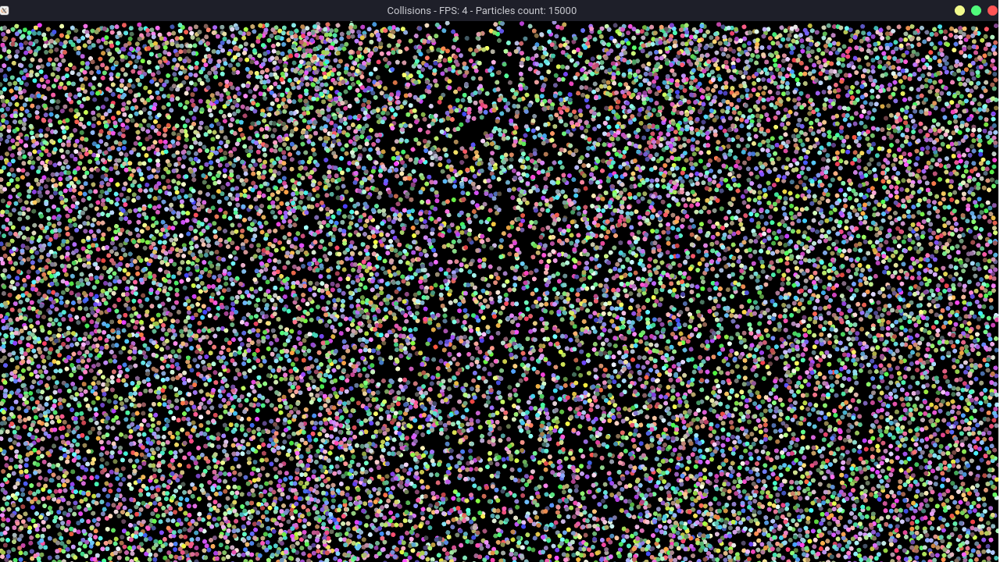
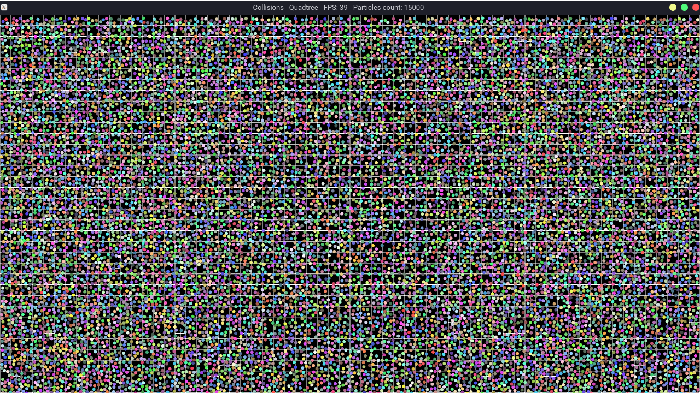
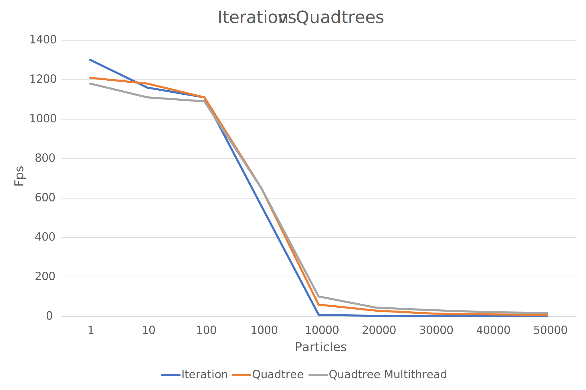
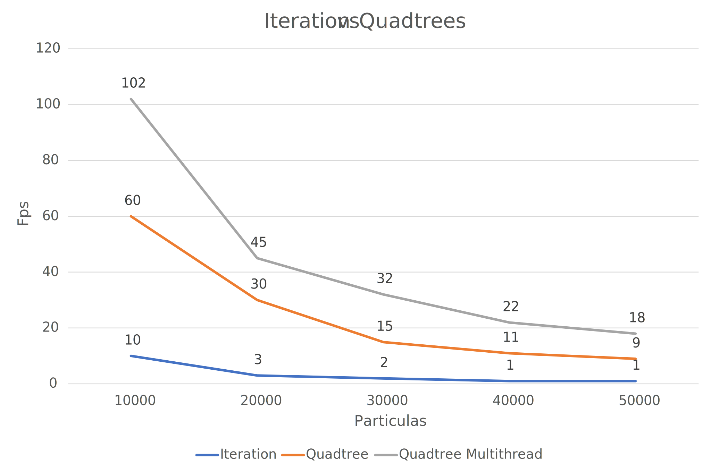

# spatial-partitioning-data
Spatial Partitioning Data Structures with examples and comparisons



## Quad Trees
Quadtree is a data structure to **efficiently** store data of points on a two-dimensional space(plane). It works just as a binary tree,
but instead of two partitions (left, right), a quadtree organize the data with four partitions (top-left, top-right, bottom-left, bottom-right).

### Construct steps
1. Divide the plane into four boxes(partitions)
2. Check if the point is inside the partition, then insert
3. If a partition doesn't contain points, insert the point
4. If a partition contains more points than the capacity, create four child partitions inside it
5. Recurse all steps for each of the children, until the point is inserted

### Search steps
1. Check if the point is inside the partition
2. If all children doesn't contain the point, return the points in the actual partition
3. Recurse all steps for each of the children, choosing the child checking if the point is in the left or right and top or bottom 

## Example
### 2D Particles simulation
#### The Problem
Think there's **n** particles in a partition on the plane, how to check if each particle is colliding with each other?
#### Iteration method
1. Iterate each point
2. Check if it's colliding each other point by iteration.

```cpp
for(int i = 0; i < n; i++) {
    for(int j = 0; j < n; j++) {
        if(particles[i].intersect(particles[j]))
            // is colliding
    }
}
```

This approach has O(n<sup>2</sup>) time complexity

#### Using Quad Tree for Optimization
1. Add each point in a Quad Tree
2. Iterate each point
3. Search for possible collisions points in the Quad Tree
4. Check if it's colling with the found points

Plus: Quad Trees organizes data by partitions, every partition could be processed separately by a thread, meaning that this method accepts multithreading

```cpp
QuadTree tree = QuadTree();

for(int i = 0; i < N; i++) {
    tree.insert(particles[i]);
}

for(int i = 0; i < N; i++) {
    Particles[] found = tree.search(particles[i]);
    
    for(Particle other : found) {
        if(particles[i].intersect(other))
            // is colliding
    }
}

```

This approach has O(n log(n)) time complexity

#### Comparison
<center>

</center>
For a small quantity of particles, the quadtree optimization don't worth the effort
<center>

</center>
But when things scales, the quadtree optimization is 9-10x faster than the iteration method.
